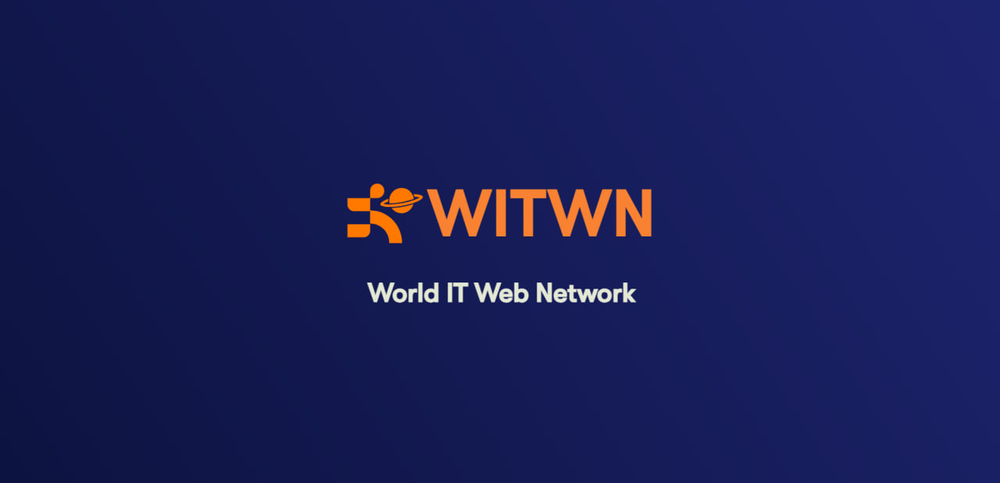

# World IT Web Network - Соціальна мережа



---

## Навігація по файлу

- [Мета проекту / Purpose of this application](#мета-розробки-цього-додатку)
- [Склад команди / Team compostion](#склад-команди)
- [Технології проекта / Project's technologies](#технології-проекту)
- [Інструкції по роботі / Instructions for launching](#інструкції-по-запуску-проекту)
- [Файлова структура / File structure](#файлова-структура-проекту)
- [Все про додатків / Everything about applications](#додатки)
- [Посилання на додаткові ресурси / Links to additional resources](#посилання-на-додаткові-ресурси)
- [Висновок з роботи / Conclusion of work](#висновок-роботи)

---

## Мета розробки цього додатку:
### Цей проект дозволяє звичайним користувачам обмінюватися інформацією без перешкод - зображеннями, текстами, тощо
### Для тих, хто хоче розгортати цей проект, він може сподобатись потенційно великими можливостями монетизації
### А для нас, як для розробників, це була практика по новим [технологіям](#технології-проекту)

---

## Склад команди: [↑](#навігація-по-файлу)
* [Терешонок Максим](https://github.com/TereshonokMaksim) - Тімлід
* [Агеєв Данило](https://github.com/Ageev-Danilo)
* [Науменко Нікіта](https://github.com/Naumenko0Nikita)

---

Python
Головна мова програмування у проекті – Відповідає повністю за бекенд /
The main programming language of the project – Fully responsible for the backend
Django
Фреймворк для створення бекенду. У цьому проекті виконував роль шаблонізатору веб сторінок, створенню ендпоінтів та легкої роботи з базою даних. /
A backend framework. In this project, it was used for web page templating, creating endpoints, and simple interaction with the database.
1. Pillow (PIL) - Необхідна бібліотека для роботи з медіа файлами користувачів. / A required library for working with user media files.
2. channels - Бібліотека, яка відповідає за створення асинхроних веб-сокетів на стороні бекенду та правильній його роботі. / A library responsible for creating asynchronous WebSocket connections on the backend and ensuring they function properly.
3. daphne - Бібліотека, що відповідає за налаштовування асинхронної роботи Django (бекенду). / A library that enables asynchronous operation of Django (backend).
### SQL
#### Мова для роботи з реляційними базами даних. Тісно співпрацює с Django. / A language for working with relational databases. It integrates closely with Django.
### HTML
#### Мова-конструктор на якій написані структури веб сторінок. Велика частина контенту до них додається за допомогою шаблонізатору Django та роботи JS. / A markup language used to structure web pages. Most content is inserted using Django templating and JavaScript.
### CSS
#### Мова для створення стилей для сторінок в HTML. / A language for designing the styles of HTML pages.
### JS
#### Мова для створення інтерактивності на стороні фронтенду (клієнта). У нашому проекті вона використувалася для відкриття форм, створення вебсокет зв'язку, пінгу і так далі. / A language for creating interactivity on the frontend (client side). In our project, it was used for opening forms, creating WebSocket connections, pinging, etc.
### Git
#### Система для керування версіями проекту та роботи учасників. / A version control system for managing project changes and team collaboration.
### Figma
#### Інструмент, який використовувся для створення дизайну та планів роботи учасників команди. / A tool used for creating the design and organizing the work plans of team members.

---

## Інструкції по запуску проекту [↑](#навігація-по-файлу)
<details>
<summary>Інструкція по запуску проекту на локальному хості (Windows)</summary>

### Як запустити проект ЛОКАЛЬНО / how to launch project LOCALLY

1. >Переконайтесь, що ви маєте версію Python >=3.11 з встановленим PIP (Package Installer for Python) / Make sure you have Python version >3.11 with PIP (Package Installer for Python) installed
2. >Встановіть цей проект собі на комп'ютер. Для цього, наведіться на зелену кнопку "<> Code" та натисність на найнижчу відкриту кнопку "Download ZIP" / Install this project on your computer. To do this, hover over the green "<> Code" button and click on the lowest open button "Download ZIP"
3. >Розархівуйте встановлену ZIP папку / Unzip the installed ZIP folder
4. >Відкрийте командний рядок у себе на комп'ютері та перейдіть у папку с проектом. Для цього відкрийте командний рядок у цій самий папці, або перейдіть у неї користуючись командою cd / Open a command prompt on your computer and navigate to the project folder. To do this, open a command prompt in the same folder, or navigate to it using the cd command.
5. >Коли ви перейшли у WITWN, напишіть цю команду / When you are in WITWN, write this command:
```bash
    pip install -f requirements.txt
    # Це встановить всі залежності у проекта (всі бібліотеки, які потрібні для нормальної роботи програми) / This will install all dependencies for the project (all libraries that are required for the program to work properly)
```
6. >Перейдіть у папку WITWN так, щоб вам був доступний файл manage.py (все ще за допомогою команди "cd") / Go to the WITWN folder so that you have access to the manage.py file (still using the "cd" command)
7. >Створіть базу даних проекту / Create a project database:
```bash
    python manage.py migrate
    # Це проведе міграції бази даних - створить всі моделі проекту та зробе його базу даних працюючою / This will perform database migrations - create all project models and make its database working
```
i. >Якщо ви маєте помилку (багато незрозумілого тексту) після використання цієї команди, використайте її ще раз, після виконання наступної команди / If you get an error (a lot of garbled text) after using this command, use it again, after running the following command:
```bash
    python manage.py makemigrations
    # Це створить міграції для бази даних. / This will create migrations for the database.
```
8. >Запустість проект / Run project:
```bash
    python manage.py runserver
    # Це запустить проект локально / This will run project locally
```
i. Якщо виникають помилки, переконайтеся, що ви не пропустили минулих пунктів / If errors occur, make sure you haven't missed any previous points.
#### Для продовження налаштування проекту, відкрийте інструкцію по обслуговуванню проекта / To continue configuring the project, open the project maintenance manual.

</details>

<details>
<summary>Інструкція по запуску проекту на локальному хості (MacOS)</summary>

### Як запустити проект ЛОКАЛЬНО на MacOS / How to launch project LOCALLY on MacOS

1. >Переконайтесь, що у вас встановлений Python версії >=3.11 з PIP (Package Installer for Python). Для перевірки відкрийте Терминал і введіть:
```bash
python3 --version
pip3 --version
Якщо Python або pip не встановлені, можете завантажити їх з офіційного сайту python.org або встановити через Homebrew:
```

```bash
brew install python
```
2. >Завантажте проект на свій комп’ютер. Для цього перейдіть на GitHub-репозиторій, наведіть курсор на зелену кнопку "<> Code" і натисніть "Download ZIP".

3. >Розпакуйте завантажений ZIP-файл, наприклад, через Finder або командою в Терминалі:

```bash
unzip path/to/downloaded/file.zip -d path/to/destination/
```
4. >Відкрийте Терминал і перейдіть у папку з проектом. Наприклад:

```bash
cd path/to/destination/project-folder
```
5. >Встановіть всі залежності проєкту за допомогою pip:

```bash
pip3 install -r requirements.txt
# Це встановить всі потрібні бібліотеки для роботи проекту
```
6. >Переконайтесь, що ви в папці з файлом manage.py (якщо потрібно, перейдіть в цю папку за допомогою cd).

7. >Створіть базу даних і застосуйте міграції:

```bash
python3 manage.py migrate
# Це створить всі таблиці в базі даних, необхідні для проекту
```
- Якщо з'являться помилки, спробуйте спочатку створити міграції командою:

```bash
python3 manage.py makemigrations
```
а потім знову:

```bash
python3 manage.py migrate
```
8. >Запустіть локальний сервер проекту:

```bash
python3 manage.py runserver
# Проект запуститься локально, зазвичай за адресою http://127.0.0.1:8000/
```
9. >Відкрийте браузер і перейдіть за адресою, яку вивів сервер (наприклад, http://127.0.0.1:8000/), щоб побачити роботу проекту.

### Поради:

- Використовуйте python3 та pip3 замість просто python і pip, бо на MacOS зазвичай встановлено Python 2.x як python за замовчуванням.

- Якщо у вас немає Homebrew, ви можете встановити його, перейшовши на https://brew.sh/.

- Якщо виникають помилки, перевірте, чи правильно виконані всі попередні кроки.


</details>

<details>
<summary>Інструкція по розгортанню проекту на Railway</summary>

### Це інструкція по розгортанню проекту на платформі Railway, з іншими платформами ця інструкція буде іншою

1. >Для цього вам знадобиться акаунт GitHub (набагато спрощує роботу), тому якщо ви не маєте акаунту GitHub, будь ласка, створіть зараз. Якщо ви маєте акаунт, ідіть до наступного пункту
2. >Встановіть цей проект за допомого "Code <>" або склонуйте, щоб створити с ним репозиторій на вашому акаунті
3. >Коли ви маєте цей проект на репозиторії, зайдіть у файл settings.py (що знаходиться у WITWN папці) та додайте у ALLOWED_HOSTS і CSRF_TRUSTED_ORIGINS домен вашого сайту.
4. >Перевірте змінну (константу) DEBUG у settings.py, якщо вона True то змініть обов'язково на False, щоб зробити ваш сайт безпечним від найлегших спроб взлому.
5. >Далі, створіть акаунт (якщо не маєте) на [Railway](https://railway.com/) та додайте підключення до вашого GitHub акаунту. 
6. >Після цього, зайдіть у deploy та помістить туди свій репозиторій. Він буде автоматично оновлюватись якщо ви зробите деякі зміни до свого репозиторію на GitHub.
7. >Додайте змінну у ваш деплой DJANGO_SETTINGS_MODULE та ставте значення "WITWN.settings"
8. >Далі, зайдіть у налаштування вашого деплою та ставте свій домен (або згенеруйте та замініть значення у ALLOWED_HOSTS i CSRF_TRUSTED_ORIGINS)
9. >Перейдіть на ваш домен. Якщо воно не працює, то перевірте виконання всіх пунктів. Якщо воно все ще не працює, то, можливо воно не встигло завантажитись, але якщо воно завантажилось та не працює, то це проблема у проекті.

</details>

---

## Файлова структура проекту [↑](#навігація-по-файлу)

```mermaid
%%{ init : { "theme" : "default", "flowchart" : { "curve" : "linear" } }}%%

flowchart LR

    A(WITWN_main) --> L(WITWN)
    A(WITWN_main) --> K(core_app)
    A(WITWN_main) --> J(chat_app)
    A(WITWN_main) --> I(user_app)
    A(WITWN_main) --> H(friends_app)
    A(WITWN_main) --> G(media)
    A(WITWN_main) --> F(templates)
    A(WITWN_main) --> E(Static Base)
    A(WITWN_main) --> D([db.sqlite3])
    A(WITWN_main) --> C([manage.py])


    LA(WITWN dummy):::hidden --> DB([asgi.py])
    LA(WITWN dummy):::hidden --> DC([settings.py])
    LA(WITWN dummy):::hidden --> DD([urls.py])
    LA(WITWN dummy):::hidden --> DE([wsgi.py])

    L --> LA

    KA(core_app dummy):::hidden --> KB(migrations)
    KA(core_app dummy):::hidden --> KC(Static Base)
    KA(core_app dummy):::hidden --> KD(templates/home)
    KA(core_app dummy):::hidden --> KE([apps.py])
    KA(core_app dummy):::hidden --> KF([urls.py])
    KA(core_app dummy):::hidden --> KG([utils.py])
    KA(core_app dummy):::hidden --> KH([views.py])

    KDA(core_app_htmls dummy):::hidden --> KDB([publications.html])
    KDA(core_app_htmls dummy):::hidden --> KDC([albums.html])
    KDA(core_app_htmls dummy):::hidden --> KDD([settings.html])
    KDA(core_app_htmls dummy):::hidden --> KDE(post_tags)

    KD --> KDA
    K --> KA


    JA(chat_app dummy):::hidden --> JB(migrations)
    JA(chat_app dummy):::hidden --> JC(Static Base)
    JA(chat_app dummy):::hidden --> JD(templates)
    JA(chat_app dummy):::hidden --> JE([admin.py])
    JA(chat_app dummy):::hidden --> JF([models.py])
    JA(chat_app dummy):::hidden --> JG([urls.py])
    JA(chat_app dummy):::hidden --> JH([views.py])
    JA(chat_app dummy):::hidden --> JI([forms.py])
    JA(chat_app dummy):::hidden --> JJ([consumers.py])
    JA(chat_app dummy):::hidden --> JK([routing.py])

    JDA(chat_app_htmls dummy):::hidden --> JDC([chats.html])

    JD --> JDA
    J --> JA


    IA(user_app dummy):::hidden --> IB(migrations)
    IA(user_app dummy):::hidden --> IC(Static Base)
    IA(user_app dummy):::hidden --> ID(templates)
    IA(user_app dummy):::hidden --> IE([admin.py])
    IA(user_app dummy):::hidden --> IF([models.py])
    IA(user_app dummy):::hidden --> IG([urls.py])
    IA(user_app dummy):::hidden --> IH([views.py])
    IA(user_app dummy):::hidden --> II([utils.py])
    IA(user_app dummy):::hidden --> IJ([forms.py])

    IDA(user_app_htmls dummy):::hidden --> IDB([confirmation.html])
    IDA(user_app_htmls dummy):::hidden --> IDC([login.html])
    IDA(user_app_htmls dummy):::hidden --> IDD([reg.html])
    IDA(user_app_htmls dummy):::hidden --> IDE([reg_success.html])
    IDA(user_app_htmls dummy):::hidden --> IDF(user_base)

    ID --> IDA
    I --> IA


    G(media) --> GA(images)
    GA(images) --> GB(avatars)
    GA(images) --> GB(group_avatars)
    GA(images) --> GB(messages)
    GA(images) --> GB(posts)


    F(templates) --> FA([base.html])
    F(templates) --> FA([main_base.html])


    EY(Static Base) --> EYA(css)
    EY(Static Base) --> EYB(js)
    EY(Static Base) --> EYC(images)
    EY(Static Base) --> EYD(fonts)

    EYA(css) --> EYAA([base_style.css])
    EYA(css) --> EYAA([base_main_page.css])
    EYA(css) --> EYAA([font_loader.css])
    EYB(js) --> EYBA([loader.js])
    EYC(images) --> EYCA(any images for web page)
    EYD(fonts) --> EYDA(Only in global static app, fonts)

    classDef hidden display: none

```

<details>
<summary>Розгорнути діаграму файлової структури проекту</summary>



</details>

---

## Додатки [↑](#навігація-по-файлу)

<details>

<summary>Пояснення до структури папки додатків</summary>

*app - Папка у якій створен веб додаток і його базові складові (інші є у папці static та templates) / The folder in which the web application and its basic components are created (others are in the static and templates folder)

    admin.py - Відповідає за реєстрацію моделі для адмін сторінки (а також за її оформлення) / Responsible for registering the model for the page admin (as well as for its design)

    apps.py - Відповідає за головну інформацію додатку для роботи Django фреймворка / Responsible for the main information of the application for the Django framework to work

    models.py - Відповідає за моделі (таблиці) у базі даних / Responsible for models (tables) in the database

    urls.py - Відповідає за встановлення посилання до сторінок, а також функцій, котрі їх оброблюють / Responsible for establishing links to pages, as well as the functions that process them

    forms.py - Відповідає за створення та перевірку на правильність форм, які пізніше використовуються для будування сторінки в html 

    consumers.py - Відповідає за створення класів вебсокетів, які активно утримують зв'язок з клієнтом на протязі усього сеансу

    routing.py - Відповідає за створення шляхів до вище споменутих вебсокетів

    views.py - Відповідає за створення ендпоінтів - функцій та класів у котрих вказано яку відповідь треба дати на запит від клієнта (користувача або JS)

    templates - Папка у якій зберігаються усі веб сторінки даного додатку / Folder in which all web pages of this application are stored

        *.html - Відповідає за конструкцію веб сторінки / Responsible for the design of the web page


project - Папка, у якій створено всі складові фундаменту проекту / Folder in which all components of the foundation of the project are created

    asgi.py - Відповідає за асинхрону роботу вебсокетів з бекендом Django

    settings.py - Відповідає за налаштування роботи бекенду / Responsible for configuring the backend

    urls.py - Відповідає за налаштування веб адресів сторінок та media файлів / Responsible for setting web addresses of pages and media files

    wsgi.py - Відповідає за синхрону роботу Django (http запити, тощо)


static - Папка у якій зберігаються усі статичні файли (js/css/картинки) / Folder in which all static files (js/css/images) are stored


    *_app - Папка яка відповідає за статичні файли вказаного додатка / The folder responsible for the static files of the specified application

        js - Папка, у якій зберігаються усі js скрипти / The folder where all js scripts are stored

            script.js - Файл з скриптом додатку / Application script file

        css - Папка, у якій зберігаються усі css стилі / The folder where all css styles are stored

            styles.css - Файл з стилями додатку / Application styles file

        images - Папка, у якій зберігаються усі зображення що НЕ змінюються протягом використання сайту

        fonts - Папка, у якій зберігаються усі шрифти / The folder where all fonts are stored
            
            *.ttf - Файл з інформацією про шрифт / Font information file


media -  Папка, у якій зберігаються усі файли, що додали користувачи (дивиться нижче). Файли також мають спеціфічну назву, яка потрібна для уникнення конфліктів про файли с однаковими назвами.

    images - Всі зображення в папці media.

        avatars - Папка, у якій зберігаються всі аватари користувачів

        group_avatars - Папка, у якій зберігаються всі аватари чат-груп

        messages - Папка, у якій зберігаються всі зображення що користувачи надіслали у повідомленнях у чатах (групових та персональних)

        posts - Папка, у якій зберігаються усі зображення, що користувачи надіслали у своїх постах (пости могуть мати багато зображень)


manage.py - Файл, який користується для роботи вас з цим проектом / The file that you use to work with this project

README.md - Файл, котрий ви зараз читаєте. Створенний для пояснювання проекту для оточуючих. / The file you are currently reading. Created to explain the project to others. 

Procfile - Файл, у якому вказані інструкції по запуску проекту для серверу Railway

requirements.txt - Файл, у якому вказані всі модулі, бібліотеки, та фреймворки, що потрібно встановити заради роботи проекту

.gitignore - Файл, у якому написані всі шляхи/імена файлів що потрібно ігнорувати перед публікацією свого репозиторію цього проекту
</details>


<details>

<summary>Натисніть, щоб побачити пояснення до додатків цього веб додатку / Click to see the explanations of the applications of this web application</summary>
<!-- NO LONGER TODO :) -->

### Core app (у коді просто core_app / in the code just core_app)
- Цей додаток відповідає за домашню сторінку, сторінку Мої Пости (те саме що й домашня, але менше контенту) та сторінку налаштувань
- На домашній сторінці можна переглядати недавні пости інших користувачів, або свої пости. Також, можна побачити чи маєте ви запити в друзі та повідомлення від друзів
- На сторінці моїх постів можна побачити тільки свої пости, що спрощує їх редагування/видалення
- На сторінці налаштувань, ви можете змінити свій профіль або переглянути свої альбоми

### Friends app (у коді friends_app / in the code friends_app)
- Цей додаток відповідає за систему друзів - їх перегляд, запити від друзів, та видалення.
- Він містить сторінки всієї короткої інформації о друзях, запитах та рекомендованих.
- Якщо вам недостатньо короткої інформації на сторінці всього, ви можете переглядати по фільтрам "Друзі", "Рекомендації" та "Запити" щоб побачити всіх, хто відноситься до цих категорій
- Також, тут є сторінка користувача, де можно коротко переглянути його альбоми, всі його пости та коротку інформацію про нього (читачі, друзі, ім'я тощо.) 

### User app (у коді просто user_app)
- Цей додаток відповідає за всю роботу з системою користувачів
- У цьому додатку є багато сторінок, але з головних - сторінка реєстрації та авторизації 
- Після реєстрації користувачу на пошту приходе повідомлення про підтвердження своєї пошти, тому одна пошта може бути тільки на один акаунт, так само як і логін / After registration, the user receives a confirmation message to their email, so one email can only be used for one account, as well as a login.

### Chat App (у коді просто chat_app / in the code just chat_app)
- Цей додаток має всього одну сторінку - сторінку чатів, на якій відбувається все, що стосується чатів.
- За допомогою цієї сторінки, користувач може написати або відправити цікаве фото своїм контактам, або вже існуючим чатам с другою людиною. 
- Якщо користувач хоче поспілкуватися с багатьма, він може створити групу користувачів, у котрій всі зможуть бачити його повідомлення, так само як і він буде бачити повідомлення всіх користувачів цієї групи. У групу він може додати лише свої контакти. Адміном групи є той, хто її створив.
- Адмін групи може додати або видалити учасників, змінити аватар та ім'я групи, про що буде сповіщено учасникам. Також, він може взагалі видалити групу, що викличе її видалення у всіх користувачів.
- Можна побачити усі зображення цієї групи або чату якщо у деталях (віконцю, котре відкривається при натисканні на три точки) вибрати "Медіа"
- Ще раз, це все відбувається за допомогою вебсокетів, тому увесь цей час користувач залишається на одній сторінці.

</details>

<details>

<summary>Детальні особливості додатків</summary>

### Система друзів

#### Друзі, це дві людини, одна з котрих надіслала запит на додавання у друзі, та друга прийняла його. Якщо друга людина відхилить його, то вони знову стануть просто користувачами між собою.
#### Два друга можуть слати один одному повідомлення, навіть, якщо їхня дружба закінчилася, але вони не видалили чат.


### Альбоми

#### Альбоми - група фото, що користувач зберігає до себе у профіль за допомогою сторінки альбомів (доступна з сторінки налаштувань)

#### Ці альбоми, можуть, коротко, бачити інші користувачі, коли вони переглядають ваш профіль. Ви можете використовувати це, як сховище ваших зображень.


### Чати

<!-- orig: сторінка чатів виконана повністю за допомогою чорної магії -->
#### Сторінка чатів виконана повністю за допомогою вебсокетів, що дозволило нам зробити її без перезавнтажень - надіслання повідомення, створення групи, редагування групи - все це без єдиного перезавантаження.

#### У чатах користувачі можуть надіслати не просто текст, а ще й зображення, котре, якщо вони загулблять, вони зможуть знайти у секції "Медіа"

#### Користувач може швидко побачити повідомлення на правій панелі на домашній сторінці у розділі "Повідомлення"

#### Якщо користувач вже на сторінці чатів, він може бачити останнє повідомлення у кожному чаті, але, доки він під'єднан до серверу (що потрібно для отримання повідомлень), він позначається як "У мережі"

</details>

---

## Посилання на додаткові ресурси:  [↑](#навігація-по-файлу)

Рекомендований сервер для деплою цього проекту: [Railway](https://railway.com/)

Дизайн проекту: [Figma](https://www.figma.com/design/20TZphWNufeAQYOe7E1sze/%D0%A1%D0%BE%D1%86%D1%96%D0%B0%D0%BB%D1%8C%D0%BD%D0%B0-%D0%BC%D0%B5%D1%80%D0%B5%D0%B6%D0%B0-World-IT?node-id=6-26&t=6FcZEGOAfhm7mSQr-1)

---

## Висновок роботи:  [↑](#навігація-по-файлу)

<details>
<summary>Висновок</summary>

Під час проекту був створений прототип соціальної мережі з функціями реального часу. Використання Django разом із Django Channels та сервером Daphne дозволило реалізувати двонаправлену комунікацію між користувачами, що є важливою частиною сучасних соціальних платформ. Така організація дала змогу впровадити функції живих чатів, миттєвих сповіщень та динамічного оновлення контенту без перезавантаження сторінки, роблячи взаємодію користувачів більш плавною та цікавою.

Проект розробляла команда з трьох осіб, кожен із яких відповідав за різні частини: логіку бекенду, налаштування асинхронних процесів, інтерактивний інтерфейс та тестування. Ефективна співпраця та комунікація допомогли подолати різні технічні складнощі й зробити продукт стабільним та зручним у використанні. Команда користувалась системою контролю версій та інструментами для управління завданнями, що забезпечило плавний робочий процес і швидке вирішення проблем.

## Основні використані технології:

- **Django 4.x** — бекенд-фреймворк для обробки основних запитів, керування базою даних, забезпечення безпеки та автентифікації користувачів;
- **Django Channels** — підтримка WebSocket-з’єднань для обміну повідомленнями в реальному часі, що виходить за межі традиційних HTTP-запитів, забезпечуючи асинхронну комунікацію;
- **Daphne** — ASGI-сервер, який дає змогу Django працювати асинхронно, ефективно обробляючи одночасні WebSocket-з’єднання;
- **Django cache** — вбудована система кешування Django, що оптимізує доступ до даних і знижує навантаження на сервер без використання зовнішніх залежностей;
- **MySQL** — реляційна база даних для зберігання інформації про користувачів та інші необхідні дані;
- **HTML, CSS, JavaScript** — фронтенд-технології для створення адаптивного, зручного інтерфейсу, який у реальному часі взаємодіє з бекендом через WebSocket;

## Реалізовані функції:

- Система реєстрації та автентифікації користувачів на основі CSRF-токенів, що забезпечує безпечний доступ і керування сесіями;
- Чат з оновленням у реальному часі завдяки WebSocket і стрічка новин, що дозволяє миттєво спілкуватись і динамічно оновлювати контент;
- Валідація вводу та обробка форм за допомогою Django для підтримки цілісності даних та покращення досвіду користувачів;
- Адаптивний дизайн, що підтримує широкий спектр пристроїв, включно з десктопами, планшетами та смартфонами.

Робота з Django Channels дала цінний досвід у сфері асинхронної розробки веб-додатків. Команда стикнулася з труднощами у налаштуванні серверного середовища, поєднанні синхронного та асинхронного коду, а також у забезпеченні коректного маршрутизації WebSocket-повідомлень. Ці виклики сприяли глибшому розумінню та набутих навичок роботи зі складними веб-застосунками. Використання Django cache дозволило уникнути залежності від зовнішніх сервісів, таких як Redis, що спростило розгортання та підтримку.

Команда приділяла особливу увагу зручності користування, проводила тестування на різних браузерах та оптимізувала інтерфейс, щоб забезпечити стабільну роботу на різних платформах. Така увага до деталей значно підвищила якість продукту.

Підсумовуючи, проект показав, що можливо створити функціональний прототип соціальної мережі з підтримкою реального часу на базі Django. Набутий досвід у роботі з асинхронними технологіями, WebSocket та командній розробці буде корисним для майбутніх проектів. Окрім технічних знань, цей досвід підкреслив важливість командної роботи, чіткої комунікації та правильного планування у розробці програмного забезпечення.

## Майбутні покращення:

- Додавання підтримки мультимедійного контенту (фото, відео) для більшої залученості користувачів;
- Впровадження розширених налаштувань приватності та персоналізації профілю;
- Розробка аналітики поведінки користувачів для покращення платформи відповідно до їхніх потреб;
- Масштабування системи з використанням додаткових механізмів кешування та балансування навантаження;
- Інтеграція із зовнішніми сервісами, такими як соціальний вхід та інструменти модерації контенту, для підвищення безпеки і функціональності.

Загалом, цей проект є міцною основою для подальшого розвитку повнофункціональної соціальної мережі з підтримкою реального часу. Досвід команди підтверджує можливість створення сучасних веб-застосунків на базі Django та пов’язаних асинхронних технологій.

</details>

<details>
<summary>Conclusion</summary>

During the project, a prototype of a social network with real-time features was created. Using Django together with Django Channels and the Daphne server allowed implementing two-way communication between users, which is essential for modern social platforms. This setup enabled features like live chats, instant notifications, and dynamic content updates without page reloads, making user interactions more seamless and engaging.

The project was developed by a team of three people, each contributing to different parts: backend logic, asynchronous process setup, interactive interface, and testing. Effective collaboration and communication helped overcome various technical challenges and make the product stable and user-friendly. The team used version control and task management tools to coordinate development, which ensured smooth workflow and efficient problem-solving.

## Main technologies used:

- **Django 4.x** — backend framework handling core requests, database management, security, and user authentication;
- **Django Channels** — supports WebSocket connections for real-time messaging beyond traditional HTTP requests, enabling asynchronous communication;
- **Daphne** — ASGI server that allows Django to run asynchronously, efficiently handling multiple simultaneous WebSocket connections;
- **Django cache** — Django’s built-in caching system used to optimize data access and reduce server load without external dependencies;
- **MySQL** — relational database for storing users’ data, posts, and other necessary information;
- **HTML, CSS, JS** — front-end technologies used to build a responsive, user-friendly interface that interacts with the backend in real time via WebSocket;

## Features implemented:

- User registration and authentication system using CSRF tokens, providing secure access and session management;
- Real-time chat and news feed updates powered by WebSocket, allowing instant communication and dynamic content refresh;
- User notifications delivered immediately when new events occur, enhancing user engagement without page reloads;
- Input validation and error handling with Django forms to ensure data integrity and improve user experience;
- Automated unit and integration testing to maintain system stability and reliability during development;
- Responsive design techniques applied to support a wide range of devices, including desktops, tablets, and smartphones.

Working with Django Channels provided valuable insights into asynchronous web development concepts and challenges. The team encountered difficulties configuring the server environment, handling the coexistence of synchronous and asynchronous code, and ensuring accurate routing of WebSocket messages. However, these challenges led to deeper understanding and experience in managing complex web applications. Using django.core.cache eliminated the need for external services like Redis, simplifying deployment and maintenance.

The team prioritized usability, conducting cross-browser testing and optimizing the interface to deliver a consistent experience across different platforms. This attention to detail contributed significantly to the overall quality of the product.

In summary, the project demonstrated that it is possible to build a functional social network prototype using Django with real-time capabilities. The knowledge and skills acquired in asynchronous programming, WebSocket communication, and collaborative development will be valuable for future projects. Moreover, this experience emphasized the importance of teamwork, clear communication, and proper planning in software development.

## Future improvements:

- Adding support for multimedia content such as files and videos to enrich user interaction;
- Implementing advanced privacy settings and profile customization options to enhance user control over data visibility;
- Developing analytics features to track user behavior and improve the platform’s responsiveness to user needs;
- Scaling the application by integrating additional caching mechanisms and load balancing to support a growing user base;
- Exploring integration with external services like social login providers and content moderation tools to enhance security and functionality.

Overall, this project serves as a solid foundation for further development of a fully-featured social network with real-time interaction support. The team’s experience confirms the feasibility of building modern web applications using Django and related asynchronous technologies.

</details>